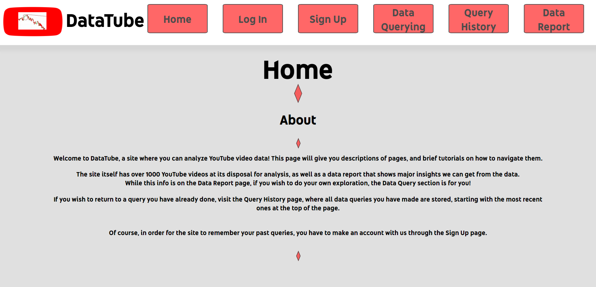

# DataTube

This is a website to allow users to analyze data collected from YouTube videos. 

The data consists of information collected from YouTube videos. This information includes
the video ID, title, description, the number of views, likes, and comments it has, the date
it was published, and the name of the channel who published the video.

To collect the data, I used a webdriver to simulate opening YouTube in the browser. Then, through
this webdriver, I typed random queries into the search bar to emulate looking for random videos. These
searches were 2 characters long each. After finding a video and clicking on it, the necessary data
was extracted through analysis of the HTML of the page the video was on.

There are a couple issues around the data collection though. For one, YouTube's video statistics are 
not 100% accurate, so there may be slight discrepancies in, for example, the amount of comments listed
and how many comments there actually are. Second, the choice to make search queries 2 characters long 
was only to balance between video diversity and stability of searches and was not based on a specific
heuristic. Third, due to Excel not supporting the Unicode character encoding, characters not compatible
with ASCII, such as emojis, had to be converted with a semantic ASCII converter.

# Tech Stack

The frontend is Typescript and React, with classic HTML and CSS.

The backend (planned, not finalized) is Node in Typescript running on an Oracle Cloud compute instance. The instance runs on Ubuntu 20.04 on an Ampere processor with 4 OCPUs and 24 GB of memory (this was the maximum performance under the Always Free tier).

The database is an Oracle Autonomous Database that uses an SQL structure. For querying the database, I am developing a REST API consisting primarily of GET methods, but some POST methods as well for authentication and user data updates (namely, for keeping track of Query History).

# Feature Summary

To gain insights into the data, there are a few options; visualization, analysis and regression. 

Visualization allows you to plot either 1 variable or 2 variable data on a graph, with several different options for graphs to choose from. 

Analysis allows you to get summary statistics for 1 variable or 2 variable data (such as mean, variance, mode, etc. for 2 variable data, it also includes things like correlation). 

Regression allows you to pick a dependent variable and one or more independent variables, and based on this, a linear regression model is created using least squares regression that best fits the data available.

In all cases, you can filter the data according to restrictions on certain values. For example, you can only select videos that got between 100 and 1000 likes for any of the 3 options.

This system is (or at least will be) facilitated through a REST API that will use GET requests in order to retrieve the necessary results for the frontend depending on the query made.

# Link

I am currently in the process of setting up the database and compute instance on Oracle Cloud in order to host this.